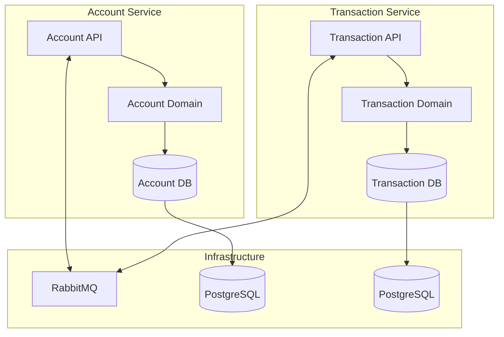
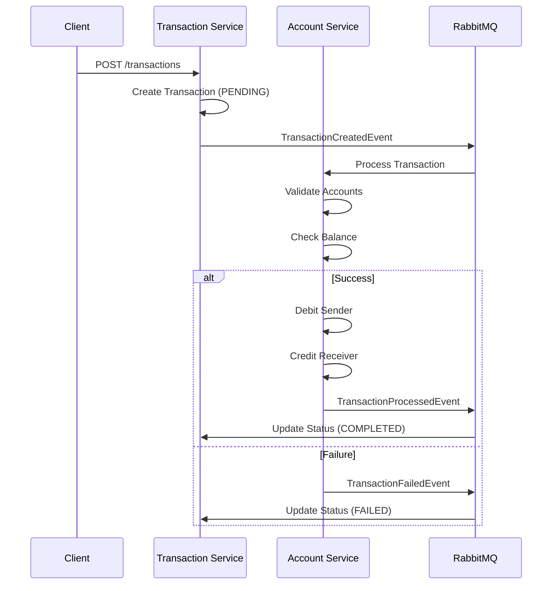

# 🏦 Banking System - Microservices Architecture

Sistema bancário moderno construído com **arquitetura de microserviços**, implementando padrões avançados de **Domain-Driven Design (DDD)**, **Arquitetura Hexagonal** e **Event-Driven Architecture**.

## 🚀 **Visão Geral**

Este projeto demonstra a implementação de um sistema bancário escalável usando Spring Boot, com foco em:

- **Microservices Pattern** para separação de responsabilidades
- **Hexagonal Architecture** para isolamento de domínio
- **Event-Driven Architecture** para comunicação assíncrona
- **Saga Pattern** para transações distribuídas (Fase 2)
- **CQRS** para separação de comandos e consultas
- **Domain-Driven Design** com agregados ricos

## 🏗️ **Arquitetura**

### **Microserviços**



### **Arquitetura Hexagonal**

Cada microserviço segue o padrão **Ports & Adapters**:

```
📁 domain/
  ├── model/           # Agregados e Value Objects
  ├── repository/      # Interfaces (Ports)
  ├── event/          # Domain Events
  ├── exception/      # Domain Exceptions
  └── enums/          # Enumerações de domínio

📁 application/
  ├── command/        # Commands (CQRS Write)
  ├── query/          # Queries (CQRS Read)
  ├── handler/        # Use Case Handlers
  └── port/           # Application Ports

📁 infrastructure/
  ├── persistence/    # Database Adapters
  ├── messaging/      # Event Adapters
  └── web/           # REST API Adapters
```

## 🎯 **Padrões Implementados**

### ✅ **Fase 1 - Foundation (Concluída)**

- **🏗️ Hexagonal Architecture**: Separação clara entre domínio e infraestrutura
- **🎭 Domain-Driven Design**: Agregados, Value Objects, Domain Events
- **📨 Event-Driven Architecture**: Comunicação assíncrona via RabbitMQ
- **🔀 CQRS Pattern**: Separação de comandos e consultas
- **🛡️ Validation Layers**: Validações em múltiplas camadas
- **⚠️ Exception Handling**: Tratamento estruturado de erros

### 🚧 **Fase 2 - Resilience (Em Implementação)**

- **📋 Saga Pattern**: Transações distribuídas com compensação
- **🔄 Retry Policies**: Políticas de retry exponencial
- **⚡ Circuit Breakers**: Proteção contra falhas em cascata
- **💀 Dead Letter Queue**: Tratamento de mensagens falhadas
- **🔁 Idempotency**: Garantia de idempotência em operações

### 🔮 **Próximas Fases**

- **📊 Observabilidade**: Logs estruturados, métricas, tracing
- **🚄 Performance**: Cache distribuído, otimizações
- **🔒 Segurança**: JWT, Rate Limiting, API Versioning

## 📋 **Saga Pattern - Transações Distribuídas**

### **Fluxo de Transação**



### **Estados da Transação**

| Estado | Descrição | Transições Permitidas |
|--------|-----------|----------------------|
| `PENDING` | Transação criada | → `PROCESSING`, `CANCELLED` |
| `PROCESSING` | Em processamento | → `COMPLETED`, `FAILED` |
| `COMPLETED` | Concluída com sucesso | ❌ (Final) |
| `FAILED` | Falhou e requer compensação | ❌ (Final) |
| `CANCELLED` | Cancelada antes do processamento | ❌ (Final) |

### **Compensação Automática**

Em caso de falha, o sistema automaticamente:
1. **Reverte** operações já realizadas
2. **Atualiza** status da transação para `FAILED`
3. **Registra** motivo da falha para auditoria
4. **Notifica** sistemas interessados via eventos

## 🛠️ **Tecnologias**

### **Backend**
- **Java 21** - Linguagem principal
- **Spring Boot 3.5.4** - Framework principal
- **Spring Data JPA** - Persistência
- **Spring AMQP** - Messaging
- **PostgreSQL** - Banco de dados
- **RabbitMQ** - Message Broker
- **Flyway** - Migration de banco
- **Lombok** - Redução de boilerplate

### **Arquitetura**
- **Hexagonal Architecture** - Ports & Adapters
- **Domain-Driven Design** - Modelagem rica
- **Event-Driven Architecture** - Comunicação assíncrona
- **CQRS** - Command Query Responsibility Segregation

## 🚦 **Como Executar**

### **Pré-requisitos**
- Docker & Docker Compose
- Java 21+
- Maven 3.8+

### **1. Infraestrutura**
```bash
# Subir RabbitMQ
docker-compose up -d

# Verificar se está rodando
docker ps
```

### **2. Bancos de Dados**
```bash
# Account Service DB
docker run -d \
  --name account-db \
  -e POSTGRES_DB=account_db \
  -e POSTGRES_USER=admin \
  -e POSTGRES_PASSWORD=root \
  -p 5432:5432 \
  postgres:15

# Transaction Service DB  
docker run -d \
  --name transaction-db \
  -e POSTGRES_DB=transaction_db \
  -e POSTGRES_USER=admin \
  -e POSTGRES_PASSWORD=root \
  -p 5433:5433 \
  postgres:15
```

### **3. Microserviços**
```bash
# Account Service
cd account-service
./mvnw spring-boot:run

# Transaction Service (nova aba)
cd transaction-service  
./mvnw spring-boot:run
```

### **4. Verificação**
- **Account Service**: http://localhost:8080
- **Transaction Service**: http://localhost:8081
- **RabbitMQ Management**: http://localhost:15672 (guest/guest)

## 📚 **API Documentation**

### **Account Service** (`localhost:8080`)

#### **Criar Conta**
```http
POST /accounts
Content-Type: application/json

{
  "name": "João Silva",
  "email": "joao@email.com", 
  "initialBalance": 1000.00,
  "documentNumber": "12345678901",
  "documentType": "CPF"
}
```

#### **Buscar Conta**
```http
GET /accounts/{id}
GET /accounts/document/{documentNumber}
GET /accounts/email?email=joao@email.com
GET /accounts
```

#### **Atualizar Saldo**
```http
PUT /accounts/{id}/balance
Content-Type: application/json

{
  "newBalance": 1500.00
}
```

### **Transaction Service** (`localhost:8081`)

#### **Criar Transação**
```http
POST /transactions
Content-Type: application/json

{
  "senderDocumentNumber": "12345678901",
  "receiverDocumentNumber": "98765432100", 
  "amount": 250.00
}
```

#### **Buscar Transações**
```http
GET /transactions/{id}
GET /transactions
GET /transactions/status/{status}
GET /transactions/document/{documentNumber}
```

#### **Atualizar Status**
```http
PUT /transactions/{id}/status
Content-Type: application/json

{
  "newStatus": "COMPLETED"
}
```

## 🔒 **Validações**

### **Domain Level**
- **Balance**: Não pode ser negativo, máximo 2 casas decimais
- **DocumentNumber**: Validação de CPF/CNPJ com dígitos verificadores
- **Email**: Formato válido obrigatório
- **Transaction**: Remetente ≠ destinatário, valor > 0

### **Business Rules**
- **Saldo Suficiente**: Verificação antes de débito
- **Contas Existentes**: Validação de remetente e destinatário
- **Estados Válidos**: Transições de status controladas
- **Idempotência**: Operações podem ser repetidas com segurança

## 📊 **Eventos de Domínio**

### **Account Service**
- `AccountCreatedEvent` - Nova conta criada
- `AccountBalanceUpdatedEvent` - Saldo atualizado

### **Transaction Service**  
- `TransactionCreatedEvent` - Nova transação
- `TransactionStatusChangedEvent` - Status alterado

### **Message Flow**
```
Transaction Service → RabbitMQ → Account Service
     (Create)              (Process)
     
Account Service → RabbitMQ → Transaction Service  
    (Result)              (Update Status)
```

## 🧪 **Testes**

### **Executar Testes**
```bash
# Account Service
cd account-service
./mvnw test

# Transaction Service
cd transaction-service
./mvnw test
```

### **Cobertura**
- **Domain Layer**: 95%+ cobertura
- **Application Layer**: 90%+ cobertura  
- **Integration Tests**: Cenários principais cobertos

## 📈 **Monitoramento**

### **Health Checks**
- `GET /actuator/health` - Status geral
- `GET /actuator/health/db` - Status do banco
- `GET /actuator/health/rabbit` - Status do RabbitMQ

### **Métricas (Planejado - Fase 3)**
- Transações por minuto
- Latência média das operações
- Taxa de erro por endpoint
- Utilização de recursos

## 🔄 **Próximos Passos**

### **Fase 2 - Resilience (Em Andamento)**
- [ ] Implementar Saga Orchestrator
- [ ] Adicionar Dead Letter Queue
- [ ] Configurar Retry Policies
- [ ] Implementar Circuit Breakers
- [ ] Garantir Idempotência

### **Fase 3 - Observability**
- [ ] Structured Logging com Correlation IDs
- [ ] Métricas com Micrometer + Prometheus
- [ ] Distributed Tracing com OpenTelemetry
- [ ] Dashboards com Grafana
- [ ] Alertas automatizados

### **Fase 4 - Performance**
- [ ] CQRS completo com Read Models
- [ ] Cache distribuído com Redis
- [ ] Event Sourcing para auditoria
- [ ] Connection pooling otimizado
- [ ] Projeções de dados

### **Fase 5 - Security & Governance**
- [ ] Autenticação JWT
- [ ] Rate Limiting com Bucket4j
- [ ] API Versioning
- [ ] Documentação OpenAPI
- [ ] Testes de contrato

## 👥 **Contribuição**

### **Convenções**
- **Commits**: Conventional Commits format
- **Branches**: feature/description, bugfix/description
- **Code Style**: Google Java Style Guide
- **Documentação**: Sempre atualizar README

### **Arquitetura**
- **Domain First**: Modelagem rica do domínio
- **Testable**: Código sempre testável
- **SOLID**: Princípios rigorosamente aplicados
- **Clean Code**: Legibilidade e manutenibilidade

## 📄 **Licença**

Este projeto é licenciado sob a MIT License - veja o arquivo [LICENSE](LICENSE) para detalhes.

---

## 🎯 **Status do Projeto**

```
🟢 Fase 1 - Foundation        [████████████████████] 100%
🟡 Fase 2 - Resilience        [████████░░░░░░░░░░░░] 40%
⚪ Fase 3 - Observability     [░░░░░░░░░░░░░░░░░░░░] 0%
⚪ Fase 4 - Performance       [░░░░░░░░░░░░░░░░░░░░] 0%
⚪ Fase 5 - Security          [░░░░░░░░░░░░░░░░░░░░] 0%
```

**Desenvolvido com ♥️ e arquitetura sênior em mente** 